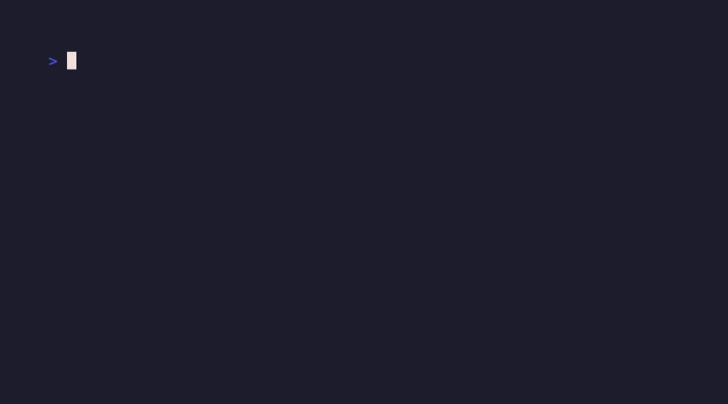

<p align="center">
  
</p>

<div align="center">

# apohara-agentguard

**Scanners audit before install. AgentGuard blocks before exec — offline, in microseconds, then jails what runs.**

[](https://github.com/SuarezPM/apohara-agentguard/actions)
[](https://github.com/SuarezPM/apohara-agentguard/releases)
[](#-license)
[](https://scorecard.dev/viewer/?uri=github.com/SuarezPM/apohara-agentguard)

<sub>SLSA L3 · OpenSSF Silver · MSRV 1.85 · no model · no network at scan time</sub>

**[Install](#-install) · [Verify](#-verify--10-seconds) · [What it does](#-what-it-does) · [Benchmarks](#-benchmarks) · [How it compares](#-how-it-compares) · [For LLM agents](#-for-llm-agents)**

A deterministic, offline Rust safety layer for AI coding agents (Claude Code, Codex, OpenCode, Kilo, Cursor, Windsurf, Antigravity, kitty-code): an **anti-bypass Bash gate** that parses command structure instead of grepping substrings, a **seccomp + Landlock sandbox** for what actually runs, a **prompt-injection firewall**, and an **MCP transport proxy** with tool-manifest pinning.

</div>

<p align="center">
  
</p>

## The problem in 20 seconds

Your agent runs shell commands for you. Two common defenses each leave a hole: **regex blocklists die on trivial obfuscation** — `x=rm; $x -rf ~` contains no `rm -rf` token to match — and **detectors don't isolate**: a command that slips through runs with full host access. Pre-install scanners only audit the repo *before* you install it. Nobody enforces *at the tool call*.

AgentGuard closes exactly that gap: **parse the structure, not the spelling — and if it runs, run it jailed.** Your command stream never leaves your machine: there is no cloud verdict to phone home to.

<details>
<summary><b>Why this exists</b> — 4 August 2026, <code>npm install</code> became a worm</summary>

At **09:35 UTC, 4 Aug 2026**, a compromised maintainer pushed `keyv@6.0.0` — a patch bump carrying a `preinstall` script that downloaded and executed the 728 KB **CHAINDROP (Shai-Hulud)** worm, then deleted itself. By **13:18 UTC** it had self-replicated to **444 packages, ~2 billion monthly installs**, and it didn't even need `npm install`: committed `.claude/settings.json` + `.vscode/tasks.json` hooks meant **opening the repo was enough to execute**. It harvested 300+ secret patterns and exfiltrated via Ethereum smart-contract C2. If your agent can run `Bash` and fetch a URL, that was your attack surface that morning.

</details>

## Install

Humans, 60 seconds:

```sh
cargo install apohara-agentguard --locked
apohara-agentguard init --yes   # wires every detected host (dry-run first with plain `init`)
apohara-agentguard doctor       # all green? you're guarded
```

No cargo? `curl -fsSL https://raw.githubusercontent.com/SuarezPM/apohara-agentguard/main/packaging/install.sh | sh` (SHA256-verified, refuses on mismatch).

**Agents install it better than humans** — no fat-fingered flags. Paste the block in [For LLM agents](#-for-llm-agents).

## Verify — 10 seconds

```sh
apohara-agentguard check 'x=rm; $x -rf ~'
# -> block: blocked dangerous leg `rm -rf ~` (destructive [rm-rf])   # exit 2

apohara-agentguard check 'git commit -m "fix the rm -rf helper"'
# -> allow                                                            # exit 0
```

Obfuscated destruction blocked; a benign commit whose *message* merely mentions `rm -rf` allowed. Structure, not tokens.

## What it does

- 🧬 **Anti-bypass command gate** — resolves variable aliases, decodes base64, expands ANSI-C quotes, handles line continuations, evaluates live `$(…)` command substitutions in double quotes, follows `IFS` tricks — keyed on a verb-aware destructive taxonomy, so `find . -delete` is caught with no `rm` in sight. *Boundary: nested/chained encoders, here-document parsing, parameter expansion, and non-literal command substitutions stay out of scope — the parser boundary is published, not hidden.*
- 🔒 **seccomp + Landlock sandbox** — a real kernel jail for agent-run code: network denied by omission, filesystem confined to one workspace root, fail-closed (Linux ≥ 5.13; refuses elsewhere rather than running unconfined).
- 🧱 **Prompt-injection firewall** — deterministic rules over tool inputs and outputs (prompts, fetched pages, files, command output), with SSRF-guarded re-fetch. *Boundary: paraphrased social engineering has no signature — measured 94.8% FN on TensorTrust, published, not hidden.*
- 🔌 **MCP transport proxy** (`agentguard-proxy`) — TOFU SHA-256 pinning of the server's tool manifest with quarantine-on-drift, plus `tools/call` gating. *Default-allow by design; enforcement comes from policy rules.*
- 🦀 **Offline and deterministic** — pure Rust, single binary, no API keys, no telemetry. Same input ⇒ same verdict. Audit log stays on local disk (off by default).

```
stdin hook event → gate (Bash structure) + firewall (text) + policy (TOML)
  → Allow / Warn / Ask (human prompt) / Block (exit 2)
  → allowed code optionally runs jailed via `sandbox --`
```

| Artifact | You run | What it is |
|---|---|---|
| `apohara-agentguard` | `check · ask · sandbox · scan · hook · mcp · init · doctor` | the CLI, the hook, and the MCP server in one binary |
| `agentguard-proxy` | `agentguard-proxy -- <server-cmd>` | transparent MCP transport wrapper (pin + gate) |
| `npx apohara-agentguard` | launcher only | resolves the release binary, verifies SHA256, refuses on mismatch |

## Benchmarks

Honest numbers you can re-run today. Full tables: [BENCHMARK.md](BENCHMARK.md).

| Axis | Result | Read it as |
|---|---|---|
| **Gate precision** | **0 / 73 FP · 0 / 37 FN** (CI-enforced) | benign allows, obfuscated destructive blocks — on an author-curated synthetic corpus, i.e. a mechanism demo, not a neutral sample (`cargo test benchmark`) |
| **Latency** | **1.41 µs p50** benign · **2.21 µs** blocked · **0.86 µs** firewall scan | per-tool-call cost, end-to-end hook (`cargo bench --bench hook_latency`) |
| **QuasarNix obfuscation** | **100% mean TPR**, 15 manipulations | *requires the opt-in `reverse-shell` pack*; default taxonomy scores 1.71% by design; FPR 4.18e-2 — we lead on perturbation delta, not on the GBDT axis |
| **MCPTox proxy** | 26.3% → **16.9% strict** (FP 0.84%) / **18.9% conservative** (FP 0%) | *labeled-oracle policy*: a measured best-case for deterministic gating (~30% is patternable); the rest is semantic misuse no proxy can catch |

We publish where the edge sits — including the firewall's 94.8% miss rate on human-written TensorTrust attacks. A safety claim with a boundary beats a marketing claim without one.

<details>
<summary><b>Known evasions</b> — parser boundary, pinned by <code>tests/gate_evasions.rs</code></summary>

### Now caught (v0.1.x)

- **ansi-c** quoting (`$'\x72\x6d' -rf ~`): decoded before scan, blocked.
- **command-substitution** (`$(echo rm) -rf ~` in double quotes): evaluated live, blocked.
- **ifs** reassignment (`IFS=X; cmdXrmX-rfX~`): word-splitting tricks resolved, blocked.
- **line-continuation** (`r\` + newline + `m -rf ~`): spliced before scan, blocked.

### Still out of scope

- **nested** / chained encoders (hex+rot13+gzip): not modeled.
- real **here-document** parsing: not modeled.
- deliberate **parameter expansion**: not modeled.
- **non-literal** command substitution in verb position (`$(curl …) -rf ~`): out of scope.

</details>

## How it compares

One axis decides everything: **enforcement moment**. Scanners audit *before install*; AgentGuard enforces *at every tool call*, offline, then jails execution. No second local tool does the runtime half.

| | **AgentGuard** | Pre-install scanners (category) |
|---|---|---|
| Enforcement | Runtime `PreToolUse` gate + kernel jail | Audit time; detection only, no containment |
| Network at scan time | None — stdin→stdout pipe | Varies; cloud-verdict designs exfiltrate the command stream |
| Latency per call | ~1–2 µs, measured | Seconds per repo/skill |
| MCP | Call-time proxy (pin + gate) | Install-time gating at best |
| Precision gate | 0-FP/0-FN committed corpora, CI-enforced | Pattern counts without FP guards |

If you want *audit before install*, pair us with a scanner. If you want *block before exec and jail after*, there is no second local option.

<details>
<summary><b>Where this is going</b> — 3 lines + pointer</summary>

Depth of the deterministic pre-action layer + the jail + the honest scorecard — not injection detection, which is commoditized and brittle. What shipped and when: [BENCHMARK.md](BENCHMARK.md), [releases](https://github.com/SuarezPM/apohara-agentguard/releases).

</details>

## For LLM agents

**Paste this entire block into your agent — it installs and configures AgentGuard without reading anything else.**

```markdown
Install and configure apohara-agentguard (deterministic offline safety layer for AI coding agents):

SOURCE OF TRUTH (read first, follow exactly):
  https://raw.githubusercontent.com/SuarezPM/apohara-agentguard/refs/tags/v0.5.4/README.md
REPO: https://github.com/SuarezPM/apohara-agentguard
VERSION: 0.5.4 (SLSA L3, OpenSSF Silver, dual MIT OR Apache-2.0, MSRV 1.85)

DO THIS, IN ORDER, AND VERIFY EACH STEP:

1) Install the binary (lowest-trust, build-from-source):
   cargo install apohara-agentguard --locked
   # Fallback only if cargo is unavailable (SHA256-verified, fails on mismatch):
   # curl -fsSL https://raw.githubusercontent.com/SuarezPM/apohara-agentguard/main/packaging/install.sh | sh

2) Wire the safety hook into every supported host (dry-run first, then apply):
   apohara-agentguard init
   apohara-agentguard init --yes
   # Detects Claude Code, Codex, OpenCode, Kilo, kitty-code, Windsurf, Cursor, Antigravity.

3) Verify the gate enforces (not advisory):
   apohara-agentguard check 'x=rm; $x -rf ~'
   # expected: block ... (destructive [rm-rf]), exit 2
   apohara-agentguard check 'git commit -m "fix the rm -rf helper"'
   # expected: allow, exit 0
   apohara-agentguard doctor
   # expected: all checks green

CONSTRAINTS:
- Do NOT use `AGENTGUARD_DISABLE=1` except as emergency kill-switch (fail-closed recovery).
- Packs (cloud/db/container + community) are OFF by default — enable only if needed.
- Sandbox is Linux-only (seccomp+Landlock, >=5.13, fail-closed elsewhere).

IF ANY STEP FAILS: surface the exact stderr/exit code — do not fall back to unverified binaries.
```

## Uninstall

```sh
apohara-agentguard init --undo   # removes only our hook entries; your config untouched
cargo uninstall apohara-agentguard
```

## Contributing

PRs welcome: fork, branch, `cargo test` (FP/FN gates run here), open the PR. Detail: [CONTRIBUTING.md](CONTRIBUTING.md) · architecture: [ARCHITECTURE.md](ARCHITECTURE.md) · threat model: [SECURITY.md](SECURITY.md).

## License

Dual-licensed **[MIT](LICENSE-MIT)** OR **[Apache-2.0](LICENSE-APACHE)**, at your option. Maintained by **[SuarezPM](https://github.com/SuarezPM)**.
